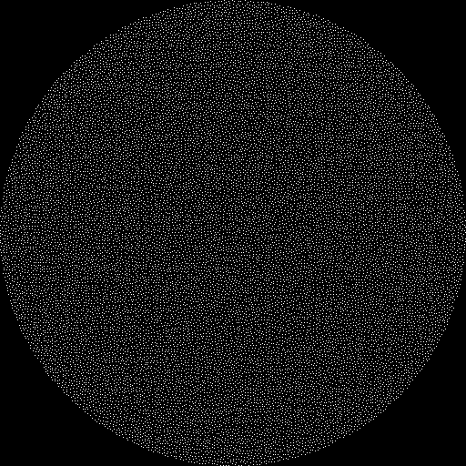
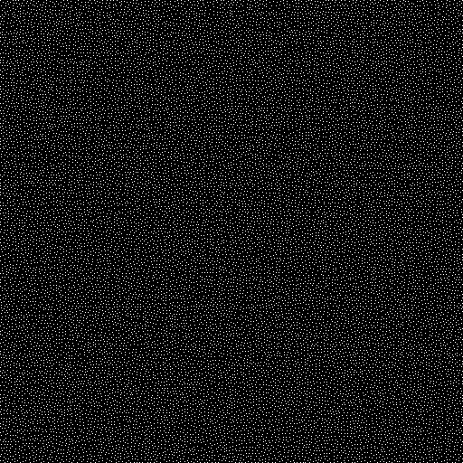
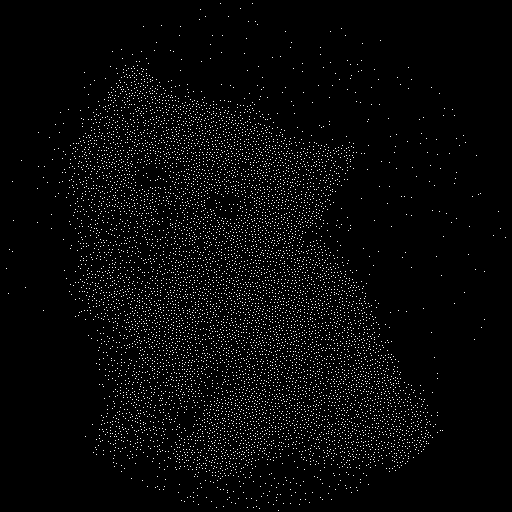
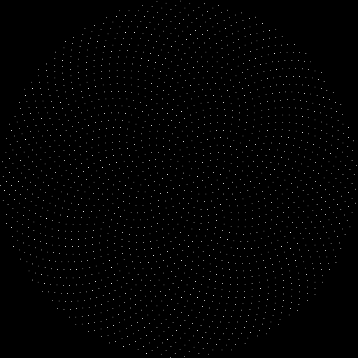
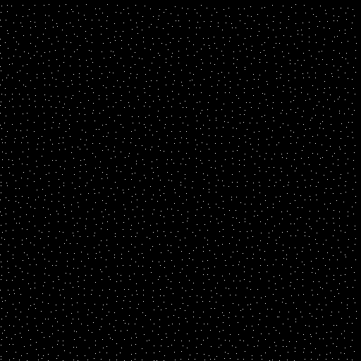
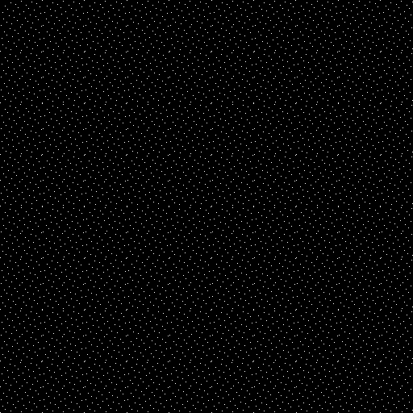

**Poisson Disk Points Generator**

(C) Sergey Kosarevsky, 2014-2024

@corporateshark sk@linderdaum.com

http://www.linderdaum.com

http://blog.linderdaum.com

=============================

Poisson disk & Vogel disk points generator in a single file header-only C++11 library.

Usage example:
--------------
```
#define POISSON_PROGRESS_INDICATOR 1
#include "PoissonGenerator.h"
...
PoissonGenerator::DefaultPRNG PRNG;
const auto Points = PoissonGenerator::generatePoissonPoints( numPoints, PRNG );
...
const auto Points = PoissonGenerator::generateVogelPoints( numPoints );
...
const auto Points = PoissonGenerator::generateJitteredGridPoints( numPoints, PRNG );
...
const auto Points = PoissonGenerator::generateHammersleyPoints( numPoints );
```

Build instructions:
-----------

Linux/OSX: ```gcc Poisson.cpp -std=c++17 -lstdc++```

Windows: ```cmake -G "Visual Studio 17 2022" -A x64```

Demo app usage:
---------------
	Poisson [density-map-rgb24.bmp] [--raw-points] [--num-points=<value>] [--square] [--vogel-disk | --jittered-grid]

Algorithm description can be found in "Fast Poisson Disk Sampling in Arbitrary Dimensions"
http://people.cs.ubc.ca/~rbridson/docs/bridson-siggraph07-poissondisk.pdf

Implementation is based on http://devmag.org.za/2009/05/03/poisson-disk-sampling/

=============================

Poisson disk



Poisson rectangle



Poisson rectangle with custom density map



Vogel disk



Jittered grid



Hammersley points


